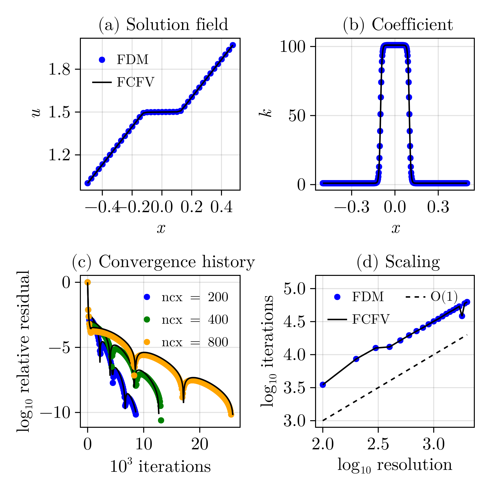

# AutoTuningGMD

This repository archives scripts that allow to reproduce results of the submitted manuscript to Geoscientific Model Development.
Automatic Dynamic Relaxation (DR) and Powell-Hestenes / Dynamic Relaxation (PHDR) solvers using Finite Difference (FD) and Face-Centered Finite Volume (FCFV) discretisations.

### 1D 
FD and FCFV Poisson solvers with heterogeneous coefficients using the DR method.

### 2D
FD models based on the PHDR and DR methods: compressible/incompressible deformation, frictional plasticity, two-phase flow 

### 3D 
FD and FCFV models of incompressible Stokes flow with many inclusions of variable viscosity.

## Quickstart
1. Clone/Download the repository
2. Open the folder in a dedicated VScode window 
3. Open Julia's REPL and type to switch to package mode: `]`
5. Install all necessary dependencies, type: `instantiate`

## Known issue
Some script rely on [ParallelStencil](https://github.com/omlins/ParallelStencil.jl). Scripts that initialize ParallelStencil in 2D and scripts that used 3D cannot be run within the same Julia session because of the macro-based design of ParallelStencil. Instead, Julia needs to be restarted to account for the differrent macros in 2D and 3D. 
